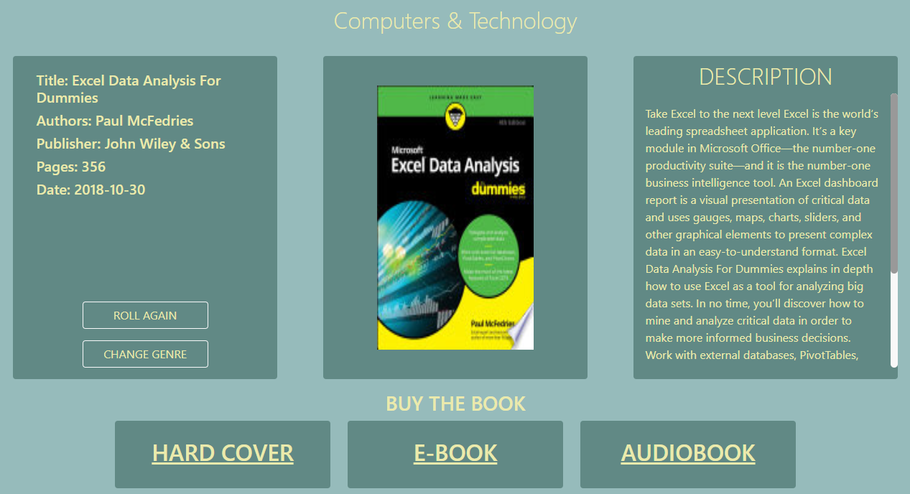

### **ReadRoll**
<sub>By: Kamil Wiśniewski</sub>

# Video demo:

## **What is ReadRoll?**

ReadRoll is a website which allows the user to "roll" a book. *What does that mean?* The user is shown a choice between various book genres and can choose one at a time. After the user clicks on one of the genres they are directed to their "rolled" book. The main feature of the website is the ability to generate a random book based on the chosen genre. ReadRoll uses Google Books API to achieve this. When the book is rolled the website displays information about it. There is also an option to buy the book i.e. be redirected to one of the hyperlinks to Amazon's website.

## Languages/Frameworks used:
- HTML
- CSS (and bootstrap)
- JavaScript
- Python (Flask)
- SQLite3
- [Google Books API](https://developers.google.com/books/)

### Overview

# **1. Python and flask**

#**1.1 app.py**

This is the file which contains all of the necessary functions for the website to work properly. It has 9 different routes.

**1.1.1 Index and About**

Both *index* and *about* render their specified html template. They do not have any other functions.

**1.1.2 Book_view and Library**

*Book_view* and *library* routes work together as the *book_view* template can only be accessed through the *library* template by choosing one of the displayed books.

*Library* fetches all of the books from the SQLite3 library table using the logged user's id from users table and then it creates a dictionary with the help of the row_factory function. This method is used quite extensively, therefore, I will refer to it as a conversion to dictionary in the following parts.
```python
cursor.execute("SELECT * FROM library WHERE user_id=?", (session["user_id"],))
lib = cursor.fetchall()
library = [dict(i) for i in lib]
```
*Library* function also detects a POST request from a search form. It displays the full library if the form is empty or displays the library based on the search query. It does so even if the query is not fully complete by using the LIKE keyword. The query can be either the title of a book or its authors.
```python
search_query = request.form.get("search-text")
cursor.execute("SELECT * FROM library WHERE user_id=? AND book_name LIKE ? OR user_id=? AND authors LIKE ?", (session["user_id"], f'%{search_query}%', session["user_id"], f'%{search_query}%'))
```

*Book_view* function takes an argument of "book_id" from the SQLite3 library table and uses it to fetch that specific book from the user's library. The data is then converted to a dictionary. The function also "listens" for a POST request and deletes the book from the user's library if the request is detected. After that it displays a message using the flash function.
```python
if request.method == 'POST':
    cursor.execute("DELETE FROM library WHERE user_id=? AND book_id=?", (session["user_id"], book_id))
    db.commit()
    flash(f"{book_name} has been deleted from your library.")
    return redirect('/library')
```

**1.1.3 History**

The *history* function selects all data from the user's istory SQLite3 table and converts them into a dictionary to be then displayed on the website.

**1.1.4 Rolled**

*Rolled* is the biggest function in app.py. It takes an argument of "genre" and utilizes it in the *search_books* function from functions.py to obtain specified amount of books as list of items(dictionaries) from Google Books API. Random index is generated with the help of *randint* which is then used to get a random book from the list.
```python
while True:
        try:
            data = search_books(genre)
            book_count = len(data["items"])
            random_book_index = random.randint(0, book_count - 1)
            random_book = data["items"][random_book_index]["volumeInfo"]
            break
```
Basic iformation about the book is then put into multiple variables in order to be displayed in the html template.

The function allows additional perks if the user is logged in. When a book is rolled, it is automatically added to the history table under the id of the user. It also has a threshold of 50 books per user so if the user has 50 books the last book added is deleted and the newest book takes the highest place.
```python
if session.get("user_id"):
    cursor.execute("SELECT position_id FROM history WHERE user_id=?", (session["user_id"],))
    positions = cursor.fetchall()
    if len(positions) > 50:
        cursor.execute("DELETE FROM history WHERE position_id=? and user_id=?", (positions[0], session["user_id"]))
        cursor.execute("INSERT INTO history (book_name, author, user_id) VALUES (?, ?, ?)", (book_title, book_authors, session["user_id"]))
        db.commit()
    else:
        cursor.execute("INSERT INTO history (book_name, author, user_id) VALUES (?, ?, ?)", (book_title, book_authors, session["user_id"]))
        db.commit()
```

The *rolled* function also detects POST request from the "add-book" form, which as the name indicates lets the user add the rolled book into their library.
```python
if title not in titles_list:
    cursor.execute("INSERT INTO library (book_name, authors, book_cover, published_date, book_description, book_genre, book_publisher, book_pages, user_id) VALUES (?, ?, ?, ?, ?, ?, ?, ?, ?)", (temp_book_title, temp_book_authors, temp_book_cover, temp_book_date, temp_book_description, temp_book_genre, temp_book_publisher, temp_book_pages, session["user_id"]))
    db.commit()
    flash(f"{temp_book_title} has been added to your library.")

    # This prevents another book being added to the history table as the page refreshes following the POST form submission
    cursor.execute("DELETE FROM history WHERE position_id=(SELECT MAX(position_id) FROM history) AND user_id=?", (session["user_id"],))
    db.commit()

    return redirect('/library')
```

**1.1.5 Register, Login and Logout**

These routes/functions work as their names indicate.

*Register* function registers the user. It requires the user to type in their desired username(rejecting it if it is already in the database), their desired password(which must be at least 8 characters long) and then to confirm their password. The function hashes the password using the PBKDF2 method from werkzeug.security library.

*Login* function allows the registered user to log into their account. It checks whether the username exists in the database and then checks if the password hashes match with the said username.

Logout function logs the user out and redirects them to the main page.

**1.2 functions.py**

**1.2.1 Login_required**

This function is taken from the Problem Set 9: Finance. It Allows certain functions to work only if the session contains "user_id".

**1.2.2 Search_books**

This function works together with the *rolled* function from app.py. It obtains the API_KEY which the developer must set before they start the program(the program does not start without it). The function contacts Google Books API and uses the page_size query of 10. This number can be raised up to 40 and the maximum amount of books obtained is capped at 1000. Number 10 is only there for testing purposes to not hit the threshold of API's daily quota and can be modified to the desires of the developer. The downside of it is that book generation times get longer as the number of pages and page sizes get bigger, however, making pages longer and page numbers higher makes the variety of the retrieved books much richer. After contacting the API the function retrieves the data in a json file and returns it.

# **2. Templates**

**2.1 Layout**

The layout template is the basis of the page. It contains everything that is on the page aside from <main>. Therefore it has the <head>, <nav> and <footer>. 
<head> contains links to bootstrap, local css and javascript static files and the icon file. 
<footer> contains a reference to Google Books API website. 
<nav> contains links to all necessary pages. My favourite feature is the dark/light theme. The navigation bar is also dynamic in terms of changing resolution.

**2.2 Index**

Index page contains a set of bootstrap cards, each of them shows an exemplary book cover of a given genre as well as the name of each genre in the card header. There are 25 genres to chose from and they represent genres present in Google Books.

**2.3 Rolled**

Rolled template contains a little bit of CSS code which helps the page stay dynamic during resolution changes. It needed the most personal tweaks as it has the biggest variety of objects out of all pages: buttons, headers, cards, images, long descriptions and flashing messages.

The page itself takes variables from the *rolled* function and displays them using jinja syntax and bootstrap cards.


**2.4 Library and book_view**


**2.5 History**

**2.6 Login and register**

# **3. Static**

**3.1 CSS**

**3.2 JS**

# **4. Database**

**4.1 readroll.db**

**4.2 readroll.sql**
